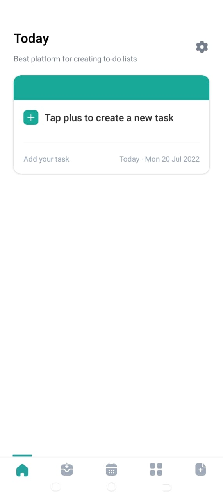
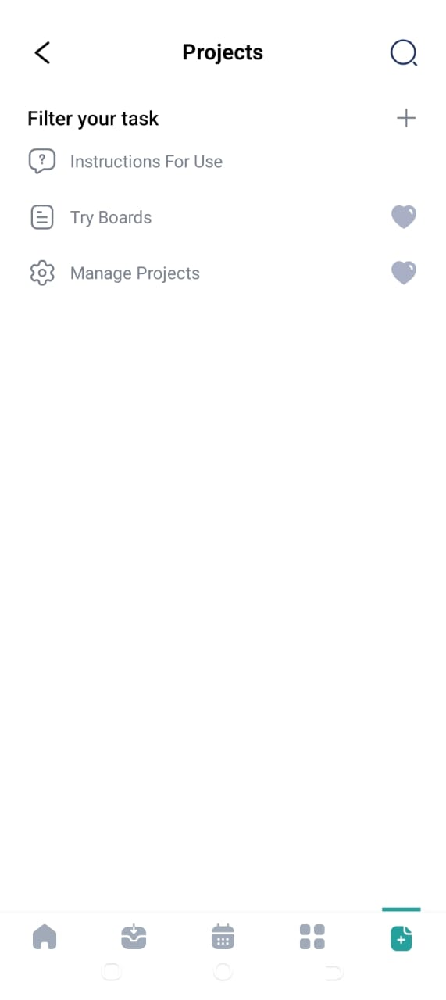
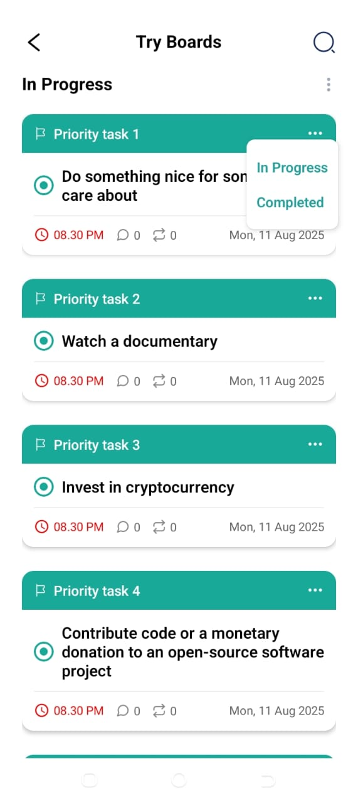
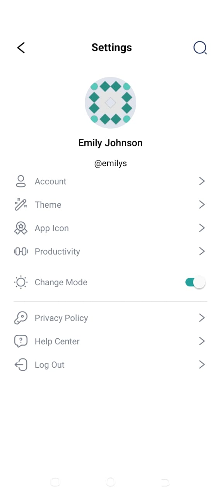

## 📌 TodyApp

A mobile application built with **Expo**, **React Native**, and **React Query** that allows users to create, view, and manage todos.  
The app features a **tab-based navigation** layout, todo filtering, and a clean, minimal UI styled with **Tailwind CSS**.

## 🚀 Setup Instructions

1. **Clone the repository**
   - git clone https://github.com/Modinat1/react-native-todyapp.git
   - cd react-native-todyapp
   - npm install
   - npx expo start

## 🎨 Design choices or assumptions made

# Architecture

- API requests are structured into a services layer (using axios) and consumed through hooks with React Query for caching, fetching, and mutation.

- UI is built using Tailwind for faster and utility-first styling.

- All colors used are configured in the tailwind.config.ts file for consistency

- Navigation is handled by expo-router, and Tabs layout.

# State Management

- Query and mutation states (loading, error, success) are handled through React Query.

- Zustand is used for global state management

# Icons

- All icons are SVGs stored in /assets/svgs for consistency and scalability.

# Filtering

- Todos are filtered into In Progress and Completed categories.

## ✨ Features Implemented

# 🖥 UI Features

- Onboarding – Designed onboarding flow for new users.

- Authentication – Designed register & login screens.

- Home & Todos – Home screen, upcoming todos screen, filter screens, and todo project management screens.

- Settings – Settings screen populated with authenticated user data from DummyJSON API.

# ⚙ Functional Features

- Authentication – Simulated login using DummyJSON Auth API.

- Fetch Todos API – Fetch todos from DummyJSON Todos.

- Create Todos API - Created todos with the DummyJSON Todos API.

- Filtering – Filtererd todos into In Progress & Completed.

- Card Layout – Todos displayed in a clean, card-based UI.

# 🗺 Navigation

- Tab-based navigation with active state indicators.

- Custom SVG icons for each tab.

# 🛠 API Integration

- Axios-based service layer for API requests.

- React Query for api consumption and caching.

# Home of screenshot

- when the settings icon on this page is clicked, it navigates to the settings page, showing the user's data from the Api

# Navigation to the inprogresss and completed todos

- click on the "Try boards" list, it navigates to pages, to filter by in-progress and completed todos

# Filtering screenshot

- clicking on the three vertical dots pops up the view to filter

# Setting screenshot

# Challenges

- DummyJSON api does not align with the figma UI design
- I could not get the todos I created, hence the getting of todos with the color theme could not take effect
- I could only get sample todos from the api, not the ones created from the todo app frontend itself

# User Login Details

some user details that cne be use to logging

1. username: emilys
   password: emilyspass

2. username: michaelw
   password: michaelwpass
